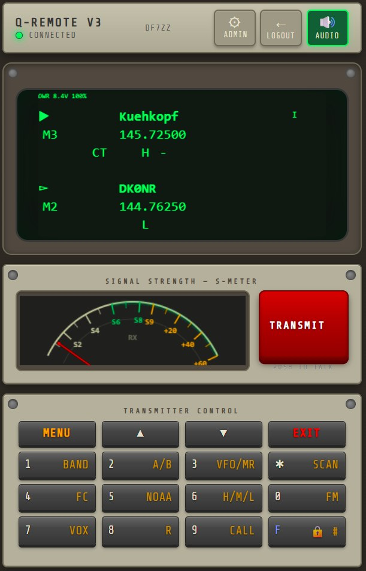
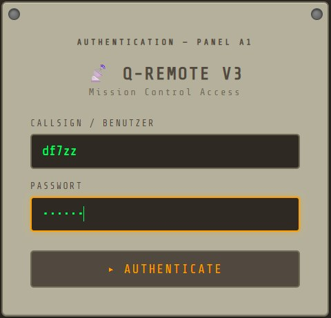
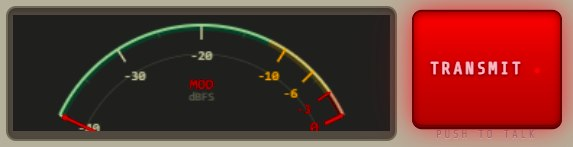
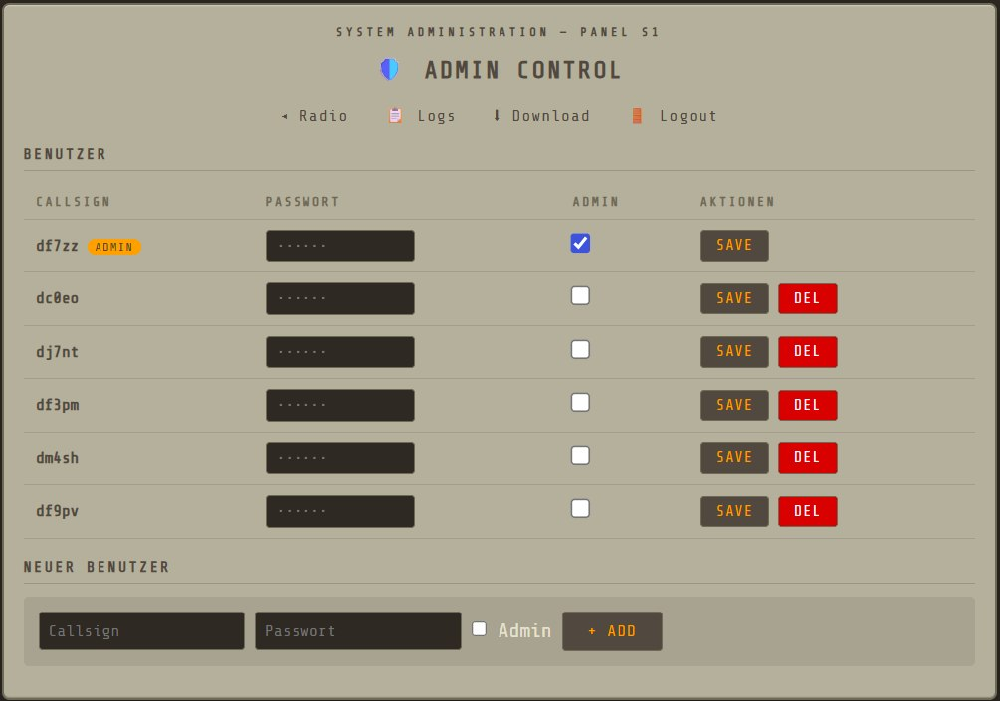

# Q-Remote V3 🤖📻

Web-based remote control for Quansheng UV-K5 ham radio. Access your radio from anywhere through the browser – full-duplex audio, live display, complete control.



*Login panel:*



*TX mode with MOD meter (mic level in dBFS):*



*Admin panel – user management:*



## Features

### ✅ Working
- **Live CRT Display** – Radio LCD rendered in real-time on HTML5 Canvas with anti-flicker
- **RX Audio** – Listen to incoming radio audio in your browser (μ-law codec, 8kHz)
- **TX Audio** – Transmit through your browser's microphone (μ-law, click-free)
- **Full Button Control** – 4×4 button grid matching the UV-K5 layout with correct labels
- **PTT (Push-to-Talk)** – Hold to transmit, with TX lock for multi-user safety
- **Analog S-Meter** – Real-time signal strength needle with continuous dBm mapping
- **Mic Modulation Meter** – dBFS level display during transmit (MOD scale)
- **Multi-User Auth** – Login system with admin panel, user management, activity logs
- **Automatic Audio Start** – Audio connects on page load

### 🔧 In Progress
- Squelch control
- Side keys (KEY1/KEY2)

## Architecture

| Layer | Technology |
|-------|-----------|
| Frontend | Vanilla JS + ES Modules, HTML5 Canvas |
| Real-time Control | Socket.IO (async WebSocket) |
| Audio Transport | Raw WebSocket + G.711 μ-law codec |
| Backend | Python FastAPI + Uvicorn |
| Radio Protocol | Quansheng UV-K5 Serial Protocol |
| Sound Card | AIOC (All-In-One-Cable) for ALSA audio I/O |

## Hardware

- **Radio:** Quansheng UV-K5
- **Sound Card:** AIOC (All-In-One-Cable) – USB audio + serial in one device
- **Server:** Raspberry Pi (HamPi) behind Caddy reverse proxy (automatic HTTPS)

## Quick Start

```bash
# Clone the repo
git clone https://github.com/3DFabrik/q-remote-v3.git
cd q-remote-v3

# Set up virtual environment
python3 -m venv venv
source venv/bin/activate
pip install -r requirements.txt

# Configure users
cp config.yaml.example config.yaml
# Edit config.yaml with your desired users

# Run
uvicorn backend.main:asgi_app --host 0.0.0.0 --port 8080
```

Open `https://your-pi:8080` in your browser. **HTTPS is required** for microphone access.

## Requirements

- Python 3.11+
- Modern browser (Chrome, Firefox, Edge, Safari)
- Raspberry Pi or Linux box with serial + audio connection to radio
- HTTPS (via Caddy, Nginx, or similar reverse proxy)

## Project Structure

```
q-remote-v3/
├── backend/
│   ├── app.py              # FastAPI app, routes, audio WebSockets
│   ├── config.py            # YAML config loader
│   ├── auth.py              # User auth, session management
│   ├── radio/
│   │   ├── connection.py    # Serial protocol, radio communication
│   │   ├── protocol.py      # Packet parsing
│   │   └── lcd.py           # LCD display state, RSSI parsing
│   ├── audio/
│   │   ├── rx_pipeline.py   # ALSA capture → μ-law → WebSocket
│   │   └── tx_pipeline.py   # WebSocket → μ-law decode → ALSA playback
│   └── control/
│       └── socketio_server.py # SocketIO events, PTT, keys, RSSI
├── frontend/
│   ├── index.html           # Main UI
│   ├── static/
│   │   ├── css/style.css    # Instrument-panel theme
│   │   └── js/
│   │       ├── app.js       # Main app, audio toggle, PTT
│   │       ├── control.js   # SocketIO client
│   │       ├── display.js   # Canvas LCD renderer
│   │       ├── smeter.js    # Analog S-Meter + MOD meter
│   │       ├── audio.js     # RX audio (μ-law decode)
│   │       └── tx_audio.js  # TX audio (mic → μ-law encode)
│   └── templates/
│       ├── admin.html       # User management
│       ├── admin_logs.html  # Activity logs
│       └── login.html       # Login page
└── config.yaml              # Users and settings
```

## License

MIT

---

Made by Norbot 🤖 & DF7ZZ
