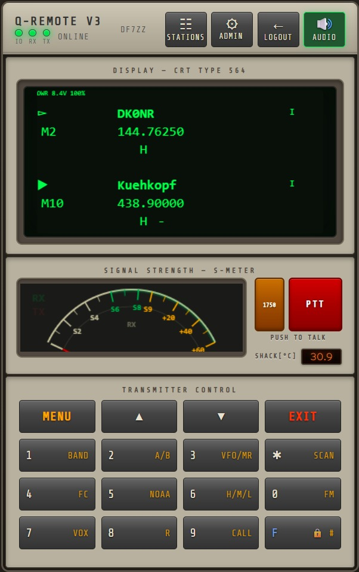
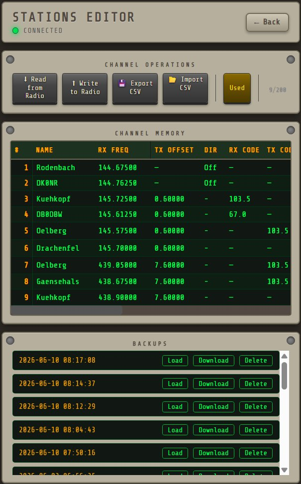

# Q-Remote V3 🤖📻

Web-based remote control for Quansheng UV-K5 ham radio with QuanshengDock firmware. Access your radio from anywhere through the browser – live CRT display, complete control, GPIO peripherals, and a full channel editor. The main UI is styled as a vintage equipment chassis with backlit keys and a CRT-style display panel.

> **Special thanks to [Nic Sure](https://github.com/nicsure) for the amazing [QuanshengDock](https://github.com/nicsure/QuanshengDock) project – the firmware, protocol documentation, and C# reference implementation that made Q-Remote V3 possible. Without this foundational work, none of this would exist. 🙏



*Equipment chassis UI: CRT display with phosphor warm-up, analog S-meter, 1750 Hz tone, PTT, and full UV-K5 keypad.*

*Login panel:*


*TX mode with MOD meter (mic level in dBFS):*


*Stations editor – full channel management with squelch control:*



*Admin panel – user management, GPIO matrix, squelch:*


## Features

### ✅ Working

**Radio Control**
- **Live CRT Display** – Radio LCD rendered in real-time on HTML5 Canvas with anti-flicker and phosphor warm-up after login
- **Equipment Chassis UI** – Retro rack-style control panel with CRT bezel, module bays, and backlit keypad buttons
- **RX Audio** – Listen to incoming radio audio in your browser (μ-law codec, 8 kHz)
- **TX Audio** – Transmit through your browser's microphone (μ-law, click-free)
- **Full Button Control** – 4×4 button grid matching the UV-K5 layout with correct labels
- **PTT (Push-to-Talk)** – Hold to transmit, with TX lock for multi-user safety
- **1750 Hz Tone** – One-touch tone burst for repeater access
- **Analog S-Meter** – Real-time signal strength needle with continuous dBm mapping
- **Mic Modulation Meter** – dBFS level display during transmit (MOD scale)
- **RX Squelch** – Configurable threshold with RSSI/audio gating, hold time, and attack/release envelope (admin panel)
- **Connection LEDs** – Header indicators for Socket.IO (IO), RX audio, and TX audio WebSockets

**Stations Editor**
- **Full Channel Management** – Read/write all 200 channels directly from the radio EEPROM
- **Inline Editing** – Edit any channel parameter directly in the data grid
- **CSV Import/Export** – Import and export channel lists as CSV files
- **Backup & Restore** – Automatic backups before every write, restore any previous snapshot
- **Empty Channel Handling** – Empty channels are correctly hidden from the radio's channel scan
- **Auto-Reset After Write** – Radio MCU resets automatically after EEPROM write to reload channel data

**GPIO & Peripherals** (Raspberry Pi)
- **GPIO Matrix** – Configure pins in the admin panel (outputs, triggers, labels)
- **Triggers** – PTT sequencer delay, header buttons, temperature threshold
- **Session-safe pins** – Optional per-pin watchdog: pin turns off on logout, tab close, or lost connection (~90 s without heartbeat)
- **DS18B20** – 1-Wire temperature sensor on GPIO 4 (display + temp-trigger source)
- **Header GPIO buttons** – Toggle buttons in the main UI bar (when configured)
- **Fail-safe** – GPIO outputs forced off on service stop / crash cleanup

**Multi-User & Security**
- **Login System** – Multi-user authentication with admin panel
- **User Management** – Add/remove users, set admin privileges and per-user timeout
- **Per-User Session Timeout** – Configurable inactivity timeout (HH:MM) per user
  - Default: 2 hours; `00:00` = unlimited
  - Automatic logout on timeout with redirect to login
  - Tab/window close triggers logout for that session
- **Session binding** – Sessions invalidated after server restart (re-login required)
- **Login rate limiting** – Per-IP brute-force protection (configurable lockout)
- **PTT Locking** – Only one user can transmit at a time
- **Activity Logging** – Login, logout, failed logins, PTT, GPIO, and admin actions

### 🔧 In Progress
- Spectrum bandscope MVP (panel under S-Meter, SCAN 0x0808)

## Architecture

| Layer | Technology |
|-------|-----------|
| Frontend | Vanilla JS + ES Modules, HTML5 Canvas |
| Real-time Control | Socket.IO (async WebSocket) |
| Audio Transport | Raw WebSocket + G.711 μ-law codec |
| Backend | Python FastAPI + Uvicorn |
| Radio Protocol | Quansheng UV-K5 Serial Protocol (QuanshengDock firmware) |
| GPIO | gpiozero + sysfs (DS18B20) |
| Sound Card | AIOC (All-In-One-Cable) for ALSA audio I/O |

## Hardware

- **Radio:** Quansheng UV-K5 with [QuanshengDock Firmware](https://github.com/nicsure/quansheng-dock-fw) (v0.32.21q)
- **Sound Card:** AIOC (All-In-One-Cable) – USB audio + serial in one device
- **Server:** Raspberry Pi (recommended), behind Caddy or nginx reverse proxy (HTTPS)

## Quick Start

### Automated install (Raspberry Pi)

```bash
git clone https://github.com/3DFabrik/q-remote-v3.git
cd q-remote-v3
chmod +x scripts/install.sh scripts/uninstall.sh
sudo ./scripts/install.sh
```

The installer will:

- Install system packages (`python3`, `venv`, `alsa-utils`, …)
- Create a Python virtualenv and install all pip dependencies (including `gpiozero`)
- Add the service user to `gpio`, `dialout`, and `audio` groups
- Create `config.local.yaml` from the example (if missing)
- Prompt for the first admin account (`users.json`) if none exists
- Install and start a **systemd** service (`q-remote`)

```bash
# Service management
sudo systemctl status q-remote
sudo journalctl -u q-remote -f
sudo systemctl restart q-remote
sudo ./scripts/uninstall.sh   # remove service only (keeps data)
```

**Installer options:** `--user pi`, `--port 8080`, `--deps-only` (no systemd), `--no-start`

### Manual install

```bash
git clone https://github.com/3DFabrik/q-remote-v3.git
cd q-remote-v3

python3 -m venv venv
source venv/bin/activate
pip install -r requirements.txt

cp config.local.yaml.example config.local.yaml
# Edit config.local.yaml (radio device, audio, …)
# Create users.json — see scripts/create_admin.py or admin panel after first login

uvicorn backend.main:asgi_app --host 0.0.0.0 --port 8080
```

### HTTPS (required for TX audio)

Browsers require a **secure context** for microphone access. Put a reverse proxy in front of port 8080:

- **Caddy** (recommended on Pi) – automatic Let's Encrypt certificates
- **nginx** – manual or certbot TLS setup

Open `https://your-domain` in your browser. Plain HTTP works for RX and control, but not for PTT/mic.

## Configuration

| File | Purpose |
|------|---------|
| `config.yaml` | Default settings (in git) |
| `config.local.yaml` | Local overrides (gitignored) — radio device, logging, rate limits |
| `users.json` | User accounts and passwords (gitignored) |
| `config.local.yaml` → `gpio.pins` | GPIO matrix (also editable via admin UI) |

Copy `config.local.yaml.example` to get started. GPIO pin definitions saved in the admin panel are written to `config.local.yaml`.

**Auth / rate limiting** (`config.yaml` or `config.local.yaml`):

```yaml
auth:
  heartbeat_miss_seconds: 90       # session-safe GPIO off after no heartbeat
  heartbeat_check_interval: 30
  login_rate_limit:
    enabled: true
    max_attempts: 5
    window_seconds: 900
    lockout_seconds: 900
```

See [docs/SPEC-GPIO.md](docs/SPEC-GPIO.md) for GPIO matrix details.

## Requirements

- Raspberry Pi OS (or Linux) with **Python 3.11+**
- `alsa-utils` (`arecord` / `aplay`) for radio audio
- Modern browser (Chrome, Firefox, Edge, Safari)
- Quansheng UV-K5 with QuanshengDock firmware
- AIOC or similar USB serial + audio interface
- HTTPS reverse proxy for transmit (microphone) from the browser

## Project Structure

```
q-remote-v3/
├── backend/
│   ├── app.py              # FastAPI app, routes, audio WebSockets, heartbeat
│   ├── main.py             # ASGI entry point (uvicorn target)
│   ├── config.py           # YAML config loader
│   ├── auth.py             # Sessions, timeouts, GPIO session tracking
│   ├── login_guard.py      # Login rate limiting (per IP)
│   ├── radio/              # Serial protocol, LCD, EEPROM
│   ├── audio/              # ALSA ↔ WebSocket pipelines
│   ├── control/            # Socket.IO server (PTT, keys, RSSI)
│   ├── gpio/               # GPIO manager + REST API
│   └── stations/           # Channel editor API + EEPROM parser
├── frontend/
│   ├── index.html          # Main remote control UI
│   ├── static/js/          # app, control, display, smeter, audio, tx_audio, stations
│   └── templates/          # login, admin, admin_logs, stations
├── scripts/
│   ├── install.sh          # Pi installer (deps + systemd)
│   ├── uninstall.sh        # Remove systemd service
│   ├── create_admin.py     # Bootstrap first user (used by install.sh)
│   └── q-remote.service.in # systemd unit template
├── docs/
│   ├── EEPROM-STRUCTURE.md
│   ├── SPEC-GPIO.md
│   └── …
├── config.yaml
└── config.local.yaml.example
```

## Security notes

Q-Remote is designed for **internet remote access** to your shack, but please:

- Use **strong passwords** and keep the admin account to yourself
- Prefer **HTTPS** and do not expose port 8080 directly to the internet without a proxy
- Review `auth.login_rate_limit` settings for your threat model
- Treat GPIO outputs as **real hardware** — use session-safe pins for PA/relay lines
- `users.json` contains plaintext passwords; protect the file (`chmod 600`)

## License

MIT

---

Made by Norbot 🤖 & DF7ZZ
